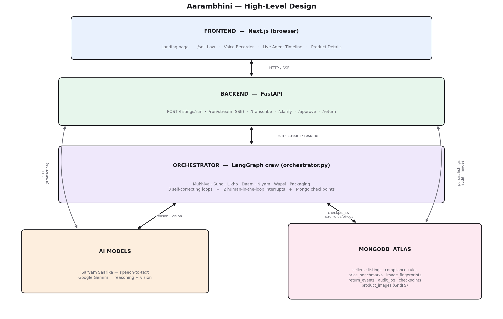

<p align="center">
  
</p>

**Aarambhini** *(“she who begins”)* is an **agentic AI co-founder for Bharat's women sellers**.

A seller speaks one voice note in her own language and adds one phone photo. A crew of
seven AI agents — wired as a LangGraph state machine — hears her, reads the photo, writes
the listing, prices it, makes it legally compliant, forecasts returns and plans packaging,
**checking and re-doing each other's work** through three self-correcting loops. It pauses
twice to ask her, shows her the finished listing **in her own language** with the English
that will publish underneath, and **nothing goes live without her tap**.

Built for **ScriptedBy{Her} 2.0**. It is an on-ramp to existing marketplaces — not another storefront.

---

## The crew

| Agent | Role | How it works |
|---|---|---|
| **Mukhiya** | The Manager | Not a file — it *is* the graph plus the gates: the quality rubric, loop routing, and the approval gate. *Deterministic* |
| **Suno** | The Ear + Cataloguer | One vision call: hears the voice note (any Indian language), reads the photo, extracts facts, fills the Meesho-style attributes, runs the photo + authenticity gate. Never invents a fact only the seller can know. *Gemini vision* |
| **Likho** | The Pen | Writes title, description, keywords and maker story. On a loop it appends the exact compliance label or a size guide — verbatim. *Gemini* |
| **Daam** | The Pricer | `price = cost + shipping + overhead + margin`; `discount floor = break-even`. Re-prices to absorb label cost. *Deterministic* |
| **Niyam** | The Rulekeeper | Reads the rules base, decides required labels/licences, drafts the exact label text (filled with her real manufacturer name + address), and **blocks** until it's applied. *Gemini + rules* |
| **Wapsi** | The Returns Guard | Forecasts why a product may be returned — and **learns from this category's real return history**. *Gemini + data* |
| **Packaging** | The Packer | Builds a packing plan from the category's fragile/perishable flags. *Deterministic* |

Money and law are deterministic on purpose, so the numbers are defensible. Every LLM agent
has a deterministic fallback, so a run never fails outright.

## The three self-correcting loops

This is what makes it *agentic*, not just "AI" — the graph contains real cycles:

1. **Quality** — Mukhiya sends a thin listing back to Likho to rewrite richer.
2. **Compliance** — Niyam demands a label; Likho appends it **and** Daam re-prices so the margin survives the extra cost.
3. **Returns** — high return risk sends Likho back to add a size/colour guide.

## Two human-in-the-loop pauses

Real LangGraph `interrupt()`s — the graph pauses with its state checkpointed to MongoDB, so
a run survives a server restart:

- **Clarify** — asks only for a *blocking* gap: no price, or a category it genuinely can't
  determine (which decides the law, so it asks rather than guesses). She isn't interrogated
  for everything else.
- **Approval** — she reviews, **edits the title, description or price**, answers any missing
  product detail **by voice in her own language**, then approves or rejects. `/approve` resumes
  the same run.

## The seller's screen — three steps, her language

The flow is three sequential steps, not a wall of forms:

1. **Tell us** — one voice note (any Indian language) + one photo + a margin slider.
2. **The crew works** — the six agents stream in live over SSE, one at a time, loops and all.
3. **Review & publish** — the listing, shown **in her language first** with a *Listen* button
   (Sarvam text-to-speech) and the exact English that will publish underneath. Compliance,
   returns and packaging sit in reference tabs; everything she must *act on* — a label that
   contradicts the listing, a missing required detail, the publish button — stays on the page,
   never hidden behind a tab.

The listing publishes in **English** (buyers and the marketplace need that). The *review* is in
**the language she just spoke** — because asking her to vouch for English she can't read is the
exact problem this product exists to solve.

## Architecture

<p align="center"></p>

Full detail — schemas, per-agent behaviour, sequence diagrams: **[docs/ARCHITECTURE.md](docs/ARCHITECTURE.md)**

**Stack:** Next.js 16 · FastAPI · LangGraph (Mongo checkpointer) · MongoDB Atlas ·
Sarvam (Saarika STT · Mayura translate · Bulbul TTS) · Google Gemini (reasoning + vision) ·
Docker → Render (API) · Vercel (web)

## Setup

**Prerequisites:** Python 3.11+, Node 18+, a MongoDB Atlas connection string, a Gemini API key, and (optionally) a Sarvam key for speech + translation.

```bash
# 1. Install
pip install -r requirements.txt           # agents, orchestrator, graph store
pip install -r backend/requirements.txt   # FastAPI web layer
npm --prefix frontend install

# 2. Configure
cp .env.example .env                      # then fill in your keys

# 3. Seed the database (idempotent)
python -m backend.seed_demo               # reference data + a realistic marketplace
```

`.env` keys:

| Key | Purpose |
|---|---|
| `GEMINI_API_KEY` / `GEMINI_MODEL` | Agent reasoning + photo reading (must be multimodal) |
| `MONGODB_URI` / `DB_NAME` | MongoDB Atlas |
| `STT_PROVIDER` | `sarvam` (default) or `gemini` |
| `SARVAM_API_KEY` / `SARVAM_STT_MODEL` | Speech-to-text (`saarika:v2.5`), translate + TTS |
| `CORS_ORIGINS` | Production origins; dev allows any localhost |
| `SESSION_SECRET` / `SESSION_TTL_HOURS` | Signs seller session tokens. Blank in dev = ephemeral per restart; **required** outside dev |
| `DEMO_SELLER_PASSWORD` | Password the seed gives demo sellers (default `aarambhini-demo`) |

Nothing is hardcoded — no key ever lives in the source.

## Run

```bash
uvicorn backend.main:app --port 8000              # API
npm --prefix frontend run dev -- --port 3001      # web
```

Open **http://localhost:3001** → *Start selling*. Log in (or register), then record or type a
description, add a photo, set your margin, and watch the agents stream in live.

**Demo logins (local seed only).** Every seeded seller shares `DEMO_SELLER_PASSWORD`
(default `aarambhini-demo`) — but only for a database *you* seed on your own machine:

| Phone | Seller |
|---|---|
| `9990000001` | Sunita Devi |
| `9990000002` | Lakshmi Ammal |
| `9990000003` | Ratna Barik |

…and four more in `backend/seed_demo.py`.

> ⚠️ **This default is published here, so it is not a secret.** Before any *public* deployment,
> rotate the demo sellers' passwords to something private (overwrite `password_hash` directly —
> re-seeding just reapplies the public default) and keep the new value out of any committed file.
> Anyone can read this README and sign in otherwise.

Seeding options:

```bash
python -m backend.seed         # reference data only (rules, benchmarks, 3 sellers)
python -m backend.seed_demo    # full marketplace: 7 sellers, 10 listings, returns history
python -m backend.seed --dry-run
```

Exercise pieces standalone:

```bash
python -m agents.daam          # pure pricing arithmetic (no API key needed)
python -m agents.niyam         # rules-based compliance
python -m agents.packaging     # packing plans
python -m agents.suno          # intake + attributes (needs a key)
streamlit run app.py           # alternative single-file UI
```

## Tests

```bash
pip install -r requirements-dev.txt       # pytest — kept out of the Docker image
pytest                                     # 65 tests, ~2.5s, no network/DB/model key
```

- **Tier 1 — pure functions.** Pricing maths, the category gate, the seller-only fabrication
  guard, the age-conflict detector, pHash/Hamming, password hashing, session tokens, login
  throttling, blocking-gap logic.
- **Tier 2 — the real graph.** Runs the actual LangGraph state machine with **every model call
  forced to fail**, checkpointed to an in-memory saver. Proves each agent's deterministic
  fallback genuinely runs and the three loops actually iterate — not just that the graph
  compiles. Writing this tier caught a live bug: a required safety label was silently dropped
  when the returns loop rewrote the description after the compliance loop had added it.

## Deploy

Frontend → **Vercel**. Backend → **Render** (Docker, long-running — a run takes ~15s and the
SSE stream stays open for all of it, so a serverless function would time out).

```bash
docker build -t aarambhini-api .           # build context is the repo root, not backend/
```

See **[DEPLOY.md](DEPLOY.md)** for the full walkthrough. Two deploy blockers, both fail-safe:
`SESSION_SECRET` is mandatory outside dev (the app refuses to boot green without it, and
`/health` reports `degraded`), and the demo sellers must not be seeded into a public database
(seed *reference data only* in prod — see the rotation note above). GridFS lives inside Mongo,
so images are already shared across instances — no S3 required.

## API

| Endpoint | Purpose |
|---|---|
| `POST /sellers` | Register a seller (phone + password) — returns a session, already logged in |
| `POST /sessions` | Log in (phone + password → bearer token) · `GET /sessions/me` resolves it |
| `POST /listings/run` | Run the crew (multipart: `voice_text`, `photo`, `desired_margin_pct`) |
| `POST /listings/run/stream` | Same, streamed live over SSE — one event per agent |
| `POST /listings/transcribe` | Speech → text (Sarvam, Gemini fallback) |
| `POST /listings/{id}/clarify` | Answer a blocking question (price / category); resumes the run |
| `GET /listings/{id}/pending-attributes` | The product details still missing, with options |
| `POST /listings/{id}/attribute` | Resolve her spoken answer into a marketplace-ready value |
| `POST /listings/{id}/approve` | Approve / edit title, description, price / reject; resumes the run |
| `POST /listings/{id}/return` | Log a real buyer return — **Wapsi learns from this** |
| `POST /language/translate` · `POST /language/speak` | Review text in her language · read it aloud |
| `GET /listings/{id}` · `GET /health` | Fetch a listing · health + DB check |

`clarify`, `approve`, `return` and the attribute/language routes require `Authorization: Bearer
<token>` **and** that the caller owns the listing. `run` uses the session when present; an
anonymous run creates an unowned listing that can never be approved — so sign in first.

## Project layout

```
orchestrator.py       LangGraph state machine — the crew, loops, interrupts
llm.py                the one model seam: llm(), llm_json(), transcribe_audio(), translate(), speak()
graph_store.py        Mongo checkpointer · GridFS photos · pHash · return stats · packer label
agents/               suno · likho · daam · niyam · wapsi · packaging
data/                 compliance_rules.json · price_benchmarks.csv · listing_attributes.json
backend/              FastAPI app, models, db, auth, routers, seed + seed_demo
frontend/             Next.js app — 3-step /sell flow, her-language review, voice recorder
tests/                Tier 1 pure functions + Tier 2 real-graph runs (pytest)
docs/                 ARCHITECTURE.md + diagrams
Dockerfile · DEPLOY.md  API container + deploy walkthrough
```

## Honesty notes

These matter more than the demo:

- **Compliance is guidance, not legal advice.** Rules are accurate at the *category* level, carry
  `needs_legal_review: true`, and cite official sources. Verified against current Indian law
  (Legal Metrology PCR 2011, FSSAI's 2026 turnover tiers, BIS hallmarking, Toys QCO, AYUSH)
  — re-verify before production.
- **The category decides the law, so it is never guessed.** If the crew can't determine it, it
  *asks* rather than defaulting — an earlier silent default could have routed food to a category
  with no FSSAI requirement.
- **Suno never invents a fact only the seller can know** — a toy's age grade, gold's purity, a
  shelf life. Those are asked, not fabricated, because a fabricated value can drive a wrong
  safety label.
- **Wapsi learns only from returns logged on Aarambhini itself** (`return_events`) — never any
  other marketplace's private data. With no history it says so and reasons from category patterns.
- **Photo authenticity is layered and conservative.** A pHash match under a *different* seller
  hard-blocks as a stolen photo; watermark / stock / AI-looking are *advisory* flags that never
  auto-reject — a false accusation against a real artisan is worse than a miss.
  **AI-generated-image detection is not reliably solved**, and we don't claim it is.
- **No EXIF check, by design.** WhatsApp strips metadata, so "no EXIF = fake" would false-flag
  most rural sellers.
- **The review is translated; the printed compliance label is not.** Legal Metrology expects the
  label in English/Hindi — Aarambhini translates the *explanation* of it, never the legal text.
- **Auth is real, but a password is the wrong credential for this seller.** Registration and
  login use phone + password (scrypt-hashed); a listing belongs to the seller who created it,
  and only she can clarify, approve or report returns on it. The whole premise, though, is that
  she *speaks once instead of typing* — **phone + OTP is the domain-correct answer**; passwords
  are a deliberate trade for a prototype with no SMS provider. Also missing: **no password reset**,
  and login throttling is **in-memory and per-process**.
- **`published` is an internal status** — real marketplace publishing (a live push to an external
  store) is a separate, honest integration, not implied by the status flip.
- Anything not built yet is listed as such in the architecture doc rather than implied.

## Swapping providers

Every model call goes through **`llm.py`** — `llm()`, `llm_json()`, `transcribe_audio()`,
`translate()`, `speak()`. Point those at another provider (Bhashini, Whisper, Azure OpenAI) and
the whole crew follows. No agent, API or UI change.
