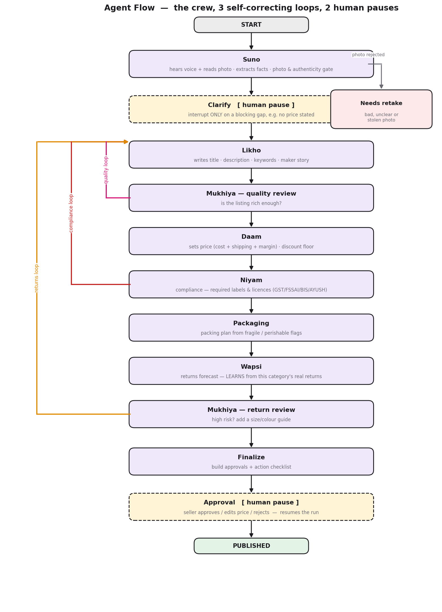

<p align="center">
  
</p>

<h3 align="center">An agentic AI co-founder for Bharat's women sellers.</h3>

<p align="center">
  A rural woman seller speaks one voice note in her own language and adds one phone photo.
  A crew of seven AI agents, wired as a LangGraph state machine, turns that into a complete,
  legally compliant, returns-proofed marketplace listing. Nothing goes live without her approval.
</p>

<p align="center">
  Built for <b>ScriptedBy{Her} 2.0</b>. Aarambhini is an on-ramp to existing marketplaces, not another storefront.
</p>

<p align="center">
  <b><a href="https://aarambhini.vercel.app">Live demo</a></b>
  &nbsp;·&nbsp;
  <a href="docs/ARCHITECTURE.md">Architecture</a>
  &nbsp;·&nbsp;
  <a href="DEPLOY.md">Deployment</a>
</p>

---

## Try it live

The full application is deployed and running.

**Web app:** https://aarambhini.vercel.app
**API health:** https://aarambhini-api.onrender.com/health

**Steps:**

1. Open **https://aarambhini.vercel.app** and click **Start selling**.
2. **Log in** with a demo account:
   | Field | Value |
   |---|---|
   | Phone | `9897969514` |
   | Password | `Scriptedforher` |

   (Or click **Create an account** to register a fresh seller with your own details.)
3. On the sell page, either record a voice note or type a product description in the text box. A ready example is prefilled.
4. Add one product photo. A sample jute-bag image is available at [this link](https://aarambhini.vercel.app/sample-jute-bag.webp) if you need one.
5. Set a margin and click **Run Aarambhini**. Watch the seven agents stream in live, one at a time.
6. Review the finished listing (shown in your language with a Listen button), edit anything if you wish, then **Approve and publish**.
7. If a store is connected, click **Send to your online store** to push it to a real Shopify storefront as a live product.

**Two things to expect (not bugs):**

* The **first request may take 30 to 60 seconds**. The API runs on a free tier that sleeps when idle and wakes on the first call. Every request after that is fast.
* A run **requires a photo**, and the photo must match the description. The intake agent stops a text-only run or an obvious mismatch on purpose.

---

## The problem

Ten crore women are in Self-Help Groups, and almost none of them sell online. Not for lack of
marketplaces. The road from a finished product to a correct listing is blocked at five points a
first-time, non-English-speaking seller cannot cross alone: cataloguing, pricing, legal
compliance, photography, and returns. Aarambhini removes all five with a single voice note.

## The crew

Seven agents, each with a clear job. Money and law are deterministic on purpose so the numbers
are defensible, and every LLM agent has a deterministic fallback so a run never fails outright.

| Agent | Role | How it works |
|---|---|---|
| **Mukhiya** | The Manager | Not a file. It *is* the graph plus its gates: the quality rubric, loop routing, and the approval gate. *Deterministic* |
| **Suno** | The Ear and Cataloguer | One vision call hears the voice note in any Indian language, reads the photo, extracts facts, fills the marketplace attributes, and runs the photo and authenticity gate. It never invents a fact only the seller can know. *Gemini vision* |
| **Likho** | The Pen | Writes the title, description, keywords, and maker story. On a loop it appends the exact compliance label or a size guide, verbatim. *Gemini* |
| **Daam** | The Pricer | `price = cost + shipping + overhead + margin`; `discount floor = break-even`. Prices the compliance-label cost in so the printed MRP matches the sale price. *Deterministic* |
| **Niyam** | The Rulekeeper | Reads the rules base, decides the required labels and licences, drafts the exact label text filled with her real name and address, and blocks until it is applied. *Gemini + rules* |
| **Wapsi** | The Returns Guard | Forecasts why a product may be returned, and learns from this category's real return history. *Gemini + data* |
| **Packaging** | The Packer | Builds a packing plan from the category's fragile and perishable flags. *Deterministic* |

### The three self-correcting loops

This is what makes it agentic rather than just "AI". The graph contains real cycles:

1. **Quality.** Mukhiya sends a thin listing back to Likho to rewrite richer.
2. **Compliance.** Niyam demands a label, Likho appends it, and Daam re-prices so her margin survives the added cost.
3. **Returns.** High return risk sends Likho back to add a size or colour guide.

### The two human-in-the-loop pauses

Real LangGraph `interrupt()` calls. The graph pauses with its state checkpointed to MongoDB, so a
run survives a server restart:

* **Clarify.** Asks only for a blocking gap: a missing price, or a category it genuinely cannot determine (which decides the law, so it asks rather than guesses).
* **Approval.** She reviews, edits the title, description, or price, answers any missing detail by voice in her own language, then approves or rejects.

## The seller's experience

The flow is three sequential steps, not a wall of forms:

1. **Tell us.** One voice note in any Indian language, one photo, a margin slider.
2. **The crew works.** The six agents stream in live over Server-Sent Events, one at a time, loops and all.
3. **Review and publish.** The listing is shown in the language she just spoke, with a Listen button (text-to-speech) and the exact English that will publish underneath. Compliance, returns, and packaging sit in reference tabs. Everything she must act on stays on the page.

The listing publishes in English, because buyers and the marketplace need that. The review is in
her language, because asking her to vouch for English she cannot read is the exact problem this
product exists to solve.

## Architecture

**System, high-level design** (browser to Vercel to Render/FastAPI to the LangGraph crew to Atlas and the AI providers):

<p align="center"></p>

**The agent crew, as a LangGraph state machine** (the 3 self-correcting loops and the 2 interrupts):

<p align="center"></p>

Full detail (schemas, per-agent behaviour, sequence diagrams) lives in **[docs/ARCHITECTURE.md](docs/ARCHITECTURE.md)**.

## Tech stack

| Layer | Technology |
|---|---|
| Frontend | Next.js 16 (App Router), React 19, TypeScript, Tailwind CSS 4 |
| Backend | FastAPI, Uvicorn, Python 3.13 |
| Orchestration | LangGraph (state machine with a MongoDB checkpointer) |
| Database | MongoDB Atlas (Motor async + PyMongo sync, GridFS for images) |
| Reasoning and vision | Google Gemini (multimodal) |
| Speech and language | Sarvam AI: Saarika (speech-to-text), Mayura (translate), Bulbul (text-to-speech) |
| Auth | scrypt password hashing, HMAC-signed session tokens |
| External store | Shopify Admin API |
| Testing | pytest (65 tests, Tier 1 pure functions and Tier 2 real-graph runs) |
| Deployment | Docker, Render (API), Vercel (web) |

Every model call goes through a single seam (`llm.py`), so swapping a provider touches one file
and nothing else.

## Run locally

**Prerequisites:** Python 3.11+, Node 18+, a MongoDB Atlas connection string, a Google Gemini API
key, and (optionally) a Sarvam AI key for speech and translation.

```bash
# 1. Install
pip install -r requirements.txt           # agents, orchestrator, graph store
pip install -r backend/requirements.txt   # FastAPI web layer
npm --prefix frontend install

# 2. Configure
cp .env.example .env                       # then fill in your keys

# 3. Seed the database (idempotent)
python -m backend.seed_demo                # reference data plus a realistic marketplace

# 4. Run
uvicorn backend.main:app --port 8000              # API
npm --prefix frontend run dev -- --port 3001      # web, http://localhost:3001
```

### Environment variables

| Key | Purpose |
|---|---|
| `GEMINI_API_KEY`, `GEMINI_MODEL` | Agent reasoning and photo reading (must be multimodal) |
| `MONGODB_URI`, `DB_NAME` | MongoDB Atlas |
| `STT_PROVIDER` | `sarvam` (default) or `gemini` |
| `SARVAM_API_KEY`, `SARVAM_STT_MODEL` | Speech-to-text, translate, and text-to-speech |
| `CORS_ORIGINS` | Production origins. Dev allows any localhost |
| `SESSION_SECRET`, `SESSION_TTL_HOURS` | Signs seller session tokens. Blank in dev is ephemeral per restart, required outside dev |
| `SHOPIFY_SHOP_DOMAIN`, `SHOPIFY_ADMIN_ACCESS_TOKEN` | Optional. Enables "Send to your store" |
| `DEMO_SELLER_PASSWORD` | Password the seed gives demo sellers |

No key ever lives in the source. `.env` is git-ignored.

### Demo logins (local seed)

The seed gives every seeded seller a shared password (`DEMO_SELLER_PASSWORD`, default
`aarambhini-demo`) for a database you seed on your own machine. `9990000002` is Lakshmi Ammal,
`9990000003` is Ratna Barik, and the full roster of seven is in `backend/seed_demo.py`.

> The default is published here, so it is not a secret. Before any public deployment, rotate the
> demo sellers' passwords to a private value and keep it out of any committed file.

## Tests

```bash
pip install -r requirements-dev.txt        # pytest, kept out of the Docker image
pytest                                      # 65 tests, about 2.5 seconds, no network or DB or key
```

* **Tier 1, pure functions.** Pricing maths, the category gate, the seller-only fabrication guard, the age-conflict detector, perceptual hashing, password hashing, session tokens, login throttling, and the blocking-gap logic.
* **Tier 2, the real graph.** Runs the actual LangGraph state machine with every model call forced to fail, checkpointed to an in-memory saver. This proves each agent's deterministic fallback genuinely runs and the three loops actually iterate, not just that the graph compiles. Writing this tier caught a live bug: a required safety label was silently dropped when the returns loop rewrote the description after the compliance loop had added it.

## Deploy

Frontend to **Vercel**. Backend to **Render** (Docker, long-running, because a run takes about 15
seconds and the live stream stays open for all of it, so a serverless function would time out).

```bash
docker build -t aarambhini-api .           # build context is the repo root, not backend/
```

See **[DEPLOY.md](DEPLOY.md)** for the full walkthrough. Two deploy blockers, both fail-safe:
`SESSION_SECRET` is mandatory outside dev (the app refuses to boot green without it), and the demo
sellers must not be seeded into a public database. GridFS lives inside Mongo, so images are
already shared across instances and no S3 is required.

## API

| Endpoint | Purpose |
|---|---|
| `POST /sellers` | Register a seller (phone and password). Returns a session, already logged in |
| `POST /sessions` | Log in (phone and password to a bearer token). `GET /sessions/me` resolves it |
| `POST /listings/run` | Run the crew (multipart: `voice_text`, `photo`, `desired_margin_pct`) |
| `POST /listings/run/stream` | The same, streamed live over Server-Sent Events, one event per agent |
| `POST /listings/transcribe` | Speech to text (Sarvam, Gemini fallback) |
| `POST /listings/{id}/clarify` | Answer a blocking question (price or category), resumes the run |
| `GET /listings/{id}/pending-attributes` | The product details still missing, with options |
| `POST /listings/{id}/attribute` | Resolve her spoken answer into a marketplace-ready value |
| `POST /listings/{id}/approve` | Approve, edit title/description/price, or reject. Resumes the run |
| `POST /listings/{id}/return` | Log a real buyer return, which Wapsi learns from |
| `POST /language/translate`, `POST /language/speak` | Review text in her language, read it aloud |
| `POST /listings/{id}/publish-to-store` | Push an approved listing to a real storefront (Shopify) |
| `GET /listings/{id}`, `GET /health` | Fetch a listing, health and DB check |

The write routes require `Authorization: Bearer <token>` and that the caller owns the listing.
`run` uses the session when present. An anonymous run creates an unowned listing that can never be
approved, so sign in first.

## Project layout

```
orchestrator.py       LangGraph state machine: the crew, 3 loops, 2 interrupts, gates
llm.py                the one model seam: llm(), llm_json(), transcribe_audio(), translate(), speak()
graph_store.py        Mongo checkpointer, GridFS photos, pHash, return stats, packer label
shopify_store.py      external-store seam: push an approved listing to a real storefront
app.py                legacy single-file Streamlit UI (secondary)
agents/               suno, likho, daam, niyam, wapsi, packaging
data/                 compliance_rules.json, price_benchmarks.csv, listing_attributes.json (source of truth)
backend/
  main.py             FastAPI app, CORS, startup indexes, /health
  auth.py             scrypt passwords, HMAC session tokens, login throttle, ownership
  models.py, db.py    Pydantic schemas, Motor client and indexes
  routers/            sessions, sellers, listings (run/approve/store), language, rules
  seed.py, seed_demo.py   reference data, full realistic marketplace
frontend/src/
  app/                page (landing), login, register, sell (the 3-step flow)
  components/         Stepper, Tabs, VoiceRecorder, ReviewInHerLanguage, FillMissingDetails, and more
  lib/                api.ts, session.ts, types.ts, recorder.ts (mic to 16kHz WAV)
tests/                Tier 1 pure functions plus Tier 2 real-graph runs (65, pytest)
docs/                 ARCHITECTURE.md, hld-diagram.png (system), agent-flow-diagram.png (crew)
Dockerfile, render.yaml, DEPLOY.md   API container, Render blueprint, deploy walkthrough
```

## Honesty notes

These matter more than the demo:

* **Compliance is guidance, not legal advice.** Rules are accurate at the category level, carry `needs_legal_review: true`, and cite official sources. Verified against current Indian law (Legal Metrology PCR 2011, FSSAI turnover tiers, BIS hallmarking, Toys QCO, AYUSH). Re-verify before production.
* **The category decides the law, so it is never guessed.** If the crew cannot determine it, it asks rather than defaulting.
* **Suno never invents a fact only the seller can know**, such as a toy's age grade or gold's purity. Those are asked, not fabricated, because a fabricated value can drive a wrong safety label.
* **Wapsi learns only from returns logged on Aarambhini itself**, never any other marketplace's private data. With no history it says so and reasons from category patterns.
* **Photo authenticity is layered and conservative.** A perceptual-hash match under a different seller hard-blocks as a stolen photo. Watermark, stock, and AI-looking signals are advisory and never auto-reject, because a false accusation against a real artisan is worse than a miss. AI-generated-image detection is not reliably solved, and it is not claimed.
* **The review is translated, the printed compliance label is not.** Legal Metrology expects the label in English or Hindi. Aarambhini translates the explanation of it, never the legal text.
* **Auth is real, but a password is the wrong credential for this seller.** Registration and login use phone and password (scrypt-hashed), and only the owner can act on a listing. The premise, though, is that she speaks once instead of typing, so phone plus OTP is the domain-correct answer. Passwords are a deliberate trade for a prototype with no SMS provider. There is no password reset yet, and login throttling is in-memory.
* Anything not built yet is listed as such rather than implied.
