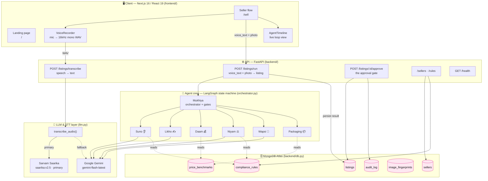
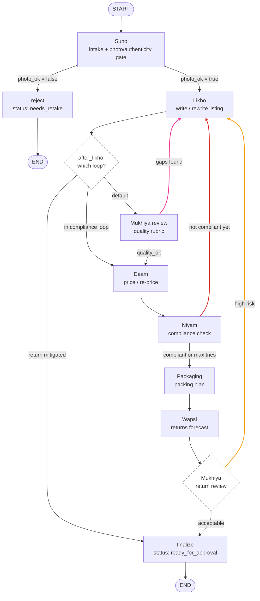
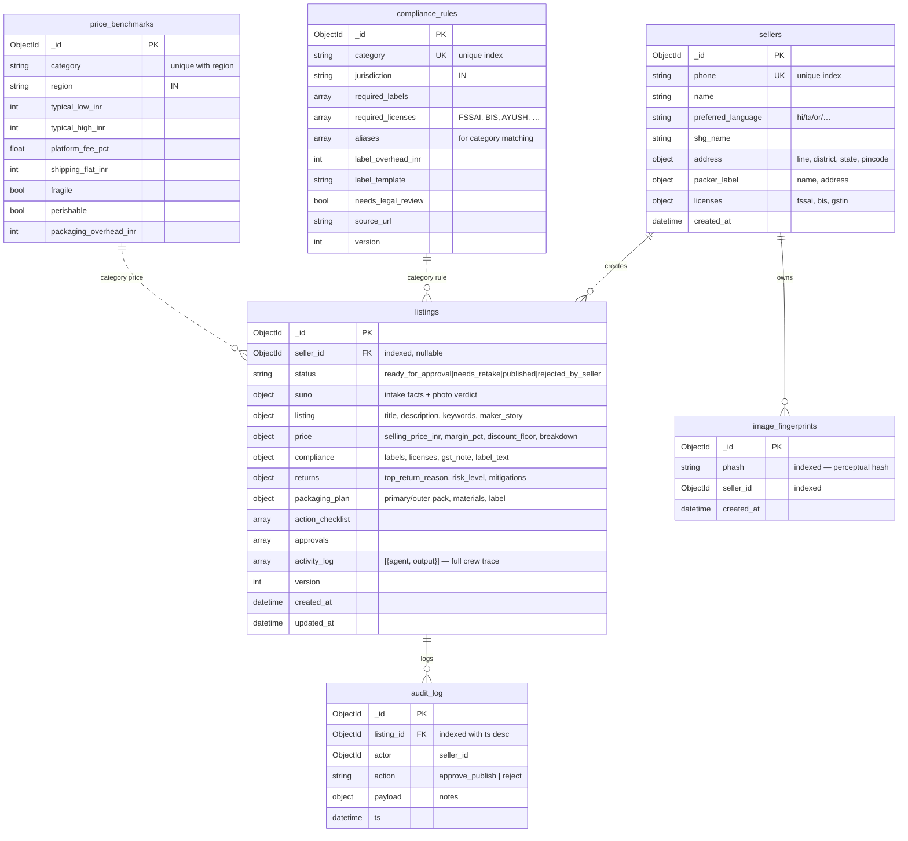
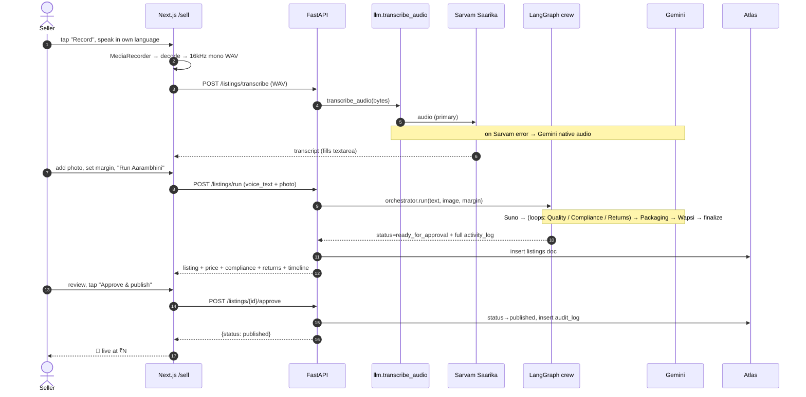

# Aarambhini — Architecture (HLD)

> Agentic AI co-founder for Bharat's women sellers: one voice note + one photo →
> a complete, compliant, returns-proofed marketplace listing, held at a human
> approval gate.

All diagrams below are **Mermaid**. Paste any fenced ` ```mermaid ` block into
[mermaid.live](https://mermaid.live), a GitHub `.md` file, Notion, or **Miro**
(Miro → *Create* → *Diagram* → *Mermaid*). They render as-is.

---

## 1. High-Level Design (system context)



**Design intent**

- **One provider seam.** Every model call goes through `llm.py` (`llm()`,
  `llm_json()`, `transcribe_audio()`). Swapping Gemini for Azure OpenAI / a
  Bhashini STT is a one-file change; agents never see the provider.
- **Deterministic where money & law live.** Daam (pricing) and Packaging are
  pure arithmetic/table lookups — no LLM — so the numbers are defensible. Suno,
  Likho, Niyam, Wapsi use the LLM but each has a deterministic fallback so the
  demo runs even when the model is rate-limited.
- **Reference data is seeded, not hardcoded.** `compliance_rules` and
  `price_benchmarks` live in Atlas (and mirror JSON/CSV in `data/`), so rules
  evolve without code changes.
- **Nothing publishes without a human.** `/run` only ever produces
  `ready_for_approval`; `status: published` is reachable *only* through
  `/approve`, which also writes an `audit_log` row.

---

## 2. The agent crew as a state machine (the 3 self-correcting loops)

This is the heart of "agentic, not just AI": the graph contains **real cycles**.
Reconstructed exactly from `orchestrator.py`.



| # | Loop | Cycle in the graph | Trigger | Fix applied | Guard |
|---|------|--------------------|---------|-------------|-------|
| 1 | **Quality** (magenta) | `review → likho → review` | Mukhiya's rubric finds a thin title / short description / <4 keywords / no maker story | Likho rewrites richer with a `revision_note` | `MAX_QUALITY_TRIES = 2` |
| 2 | **Compliance** (red) | `niyam → likho → daam → niyam` | Niyam demands a required on-pack label | Likho appends exact label text **verbatim**; Daam re-prices to absorb `label_overhead_inr` so margin survives | `MAX_COMPLIANCE_TRIES = 3` |
| 3 | **Returns** (amber) | `return_review → likho → finalize` | Wapsi flags `risk_level: high` or `needs_seller_confirmation` | Likho weaves in a size/colour guide; listing held for seller confirm | one-shot (`return_mitigated` flag) |

**Two reject gates** live inside Suno (photo quality + image authenticity) and
stop bad input before any downstream work. **One interrupt** (`finalize`) holds
everything for the seller.

---

## 3. Data model (MongoDB Atlas)

Six collections. Indexes and names are the single source of truth in
`backend/db.py`; document shapes come from `backend/models.py` and the writers.



**Indexes** (`ensure_indexes()`, idempotent on startup)

| Collection | Index | Purpose |
|---|---|---|
| `sellers` | `phone` **unique** | one account per number; seed upserts by phone |
| `listings` | `seller_id`, `status` | seller's listings; approval-queue queries |
| `compliance_rules` | `category` **unique** | one rule per category; seed upserts |
| `price_benchmarks` | `(category, region)` **unique** | one benchmark per category/region |
| `image_fingerprints` | `phash`, `seller_id` | duplicate/stock-photo detection (authenticity gate) |
| `audit_log` | `(listing_id, ts desc)` | tamper-evident approval trail |

**Seed state** (`python -m backend.seed`): 13 compliance rules, 13 price
benchmarks, 3 demo SHG sellers (Hindi / Tamil / Odia). Idempotent — upserts by
natural key, so re-running refreshes rather than duplicates.

---

## 4. Request sequence — voice note to published listing



---

## 5. How each agent works (in detail)

Legend — **LLM** = calls Gemini via `llm.py`; **Det.** = deterministic (no model).

### Mukhiya — the Manager · `orchestrator.py` · **Det.**
Not a separate file; it *is* the graph plus the gate functions. Owns:
`photo_gate`, `after_likho`, `quality_gate` (the rubric in `review_node`),
`compliance_gate`, `return_gate`, and `finalize_node` (assembles `approvals` +
`action_checklist`). It arbitrates all three loops and enforces the human gate.
The quality rubric is intentionally deterministic: title 8–120 chars, description
≥60 chars, ≥4 keywords, non-empty maker story.

### Suno — the Ear · `agents/suno.py` · **LLM (+ photo gate)**
- **In:** `voice_text` (any language), optional `PIL.Image`.
- **Out:** `product_name, quantity, cost_price_inr, material, category, attributes{size,colour}, photo_ok, photo_issue, detected_language`.
- Categorizes by matching the seller's words against `aliases` from
  `compliance_rules`. Judges the photo (dark/blurry/too-small) and sets
  `photo_ok=false` with a kind `photo_issue` to trigger the reject gate.
- **Fallback:** regex number extraction + Devanagari detection for language.

### Likho — the Pen · `agents/likho.py` · **LLM**
- **In:** Suno facts, plus one of three optional loop inputs:
  `append_disclaimer` (compliance), `revision_note` (quality), `size_guide` (returns).
- **Out:** `title, description, keywords[], maker_story, appended_disclaimers[]`.
- **Belt-and-braces:** after the model returns, code *guarantees* the disclaimer
  and size-guide text are physically present in the description — the compliance
  loop cannot be defeated by a model that "forgets" the label.

### Daam — the Pricer · `agents/daam.py` · **Det.**
- `price = cost + shipping + extra_overhead + margin`;
  `discount_floor = cost + shipping + overhead` (break-even — never sell below).
- Reads `shipping_flat_inr` and the typical range from `price_benchmarks`.
- In the compliance loop it receives `extra_overhead_inr` (the label cost) and
  re-prices so the margin survives — this is what makes loop #2 *economically*
  correct, not just legally.

### Niyam — the Rulekeeper · `agents/niyam.py` · **LLM (+ rules base)**
- Reads `required_labels` / `required_licenses` for the category.
- If labels are required, drafts the **exact one-line on-pack label text** (LLM,
  grounded in the required fields; deterministic placeholder fallback).
- Stays `compliance_ok=false` until `label_applied=True` — i.e. until Likho has
  appended the text and Daam has absorbed the overhead. Missing *licenses*
  (FSSAI/BIS/AYUSH) are surfaced as warnings, never auto-obtained.

### Wapsi — the Returns Guard · `agents/wapsi.py` · **LLM**
- **In:** product name, category, attributes.
- **Out:** `top_return_reason, risk_level (low|medium|high), mitigations[], needs_seller_confirmation, confirmation_prompt`.
- **Honesty rule:** it *reasons* about likely return drivers from general Indian
  e-commerce knowledge — it does **not** query any marketplace's private return
  data. High risk or an uncertain attribute triggers loop #3.

### Packaging · `agents/packaging.py` · **Det.**
- Reads `fragile` / `perishable` flags from `price_benchmarks` (same table as
  Daam, so the flags live in one place).
- **Out:** `primary_pack, outer_pack, handling_note, materials[], shipping_label`
  (e.g. `FRAGILE · HANDLE WITH CARE`, `PERISHABLE · THIS SIDE UP`, `KEEP DRY`).

---

## 6. Speech-to-Text — model choice & alternatives

**Shipped:** **Sarvam AI — Saarika** (`saarika:v2.5`) as primary, with **Google
Gemini** native audio as an automatic fallback. Both live behind
`llm.transcribe_audio()` and are exposed at `POST /listings/transcribe`. Audio is
captured in-browser and normalized to **16 kHz mono WAV**
(`frontend/src/lib/recorder.ts`) before upload, so one endpoint feeds either
provider unchanged.

Provider selection (env-driven, `llm.py`):

```
STT_PROVIDER=sarvam        # sarvam (default) | gemini
SARVAM_API_KEY=…           # required for the Sarvam path
SARVAM_STT_MODEL=saarika:v2.5
```

`transcribe_audio()` returns `{"text", "provider"}` where `provider` is
`sarvam`, `gemini`, or `gemini_after_sarvam_error` — so the response is honest
about which engine actually ran.

Why **Sarvam** is primary:
- **India-first ASR** — strongest on the regional languages our sellers actually
  speak (the demo includes an Odia seller) and on **code-mixed** speech
  (Hinglish/Tamlish), which is how rural sellers talk.
- Trained on **noisy Indian phone audio** — it addresses background disturbance
  by domain match, not a generic denoiser.
- Auto-detects language (`language_code=unknown`), generous hackathon credits.

Why **Gemini** stays as fallback:
- Already the project's LLM (one key already present); a Sarvam outage or credit
  exhaustion never breaks a live demo.

Other options (swap inside `transcribe_audio()` only):

| Option | Why consider | Trade-off |
|---|---|---|
| **Bhashini (ULCA / govt. of India)** | Free, all 22 scheduled languages; most Bharat-aligned public-good option | Per-language endpoints; more integration surface |
| **AssemblyAI** | World-class generic noise filtration + audio intelligence | Narrower Indian *regional*-language coverage |
| **OpenAI Whisper (self-host `large-v3`)** | No per-call cost, offline/on-prem | GPU to run; heavier ops |
| **AI4Bharat IndicWhisper** | Open weights fine-tuned on Indian languages | Self-hosting + maintenance |

Because everything is normalized to WAV and isolated behind one function,
changing providers touches **only `llm.py`** — no API, agent, or UI change.

---

## 7. File map

```
Aarambhini/
├─ orchestrator.py        # LangGraph state machine (Mukhiya) — the 3 loops
├─ llm.py                 # Gemini seam: llm(), llm_json(), transcribe_audio()
├─ agents/
│  ├─ suno.py             # intake + photo gate         (LLM)
│  ├─ likho.py            # copywriting                 (LLM)
│  ├─ daam.py             # pricing                     (deterministic)
│  ├─ niyam.py            # compliance adversary        (LLM + rules)
│  ├─ wapsi.py            # returns forecast            (LLM)
│  └─ packaging.py        # packing plan                (deterministic)
├─ backend/
│  ├─ main.py             # FastAPI app + CORS + startup indexes
│  ├─ db.py               # Atlas (Motor) + collections + indexes
│  ├─ models.py           # Pydantic schemas
│  ├─ seed.py             # seed rules + benchmarks + demo sellers
│  ├─ data/               # compliance_rules.json, price_benchmarks.csv
│  └─ routers/            # listings (run/transcribe/approve), sellers, rules
└─ frontend/              # Next.js 16 · /sell flow · VoiceRecorder · AgentTimeline
```
